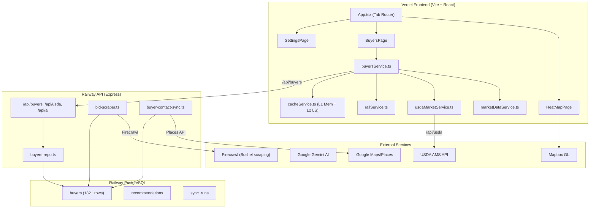
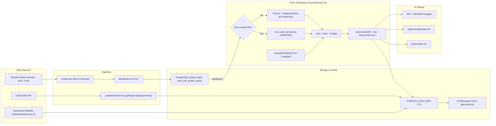
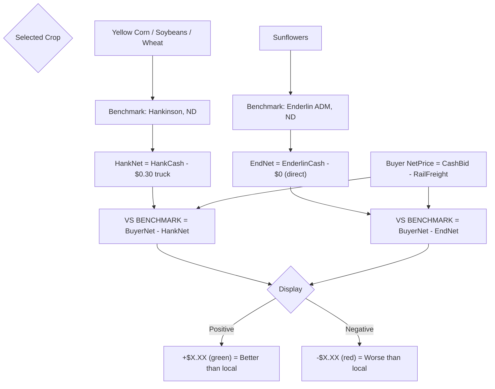

# Corn Intel — Data Flow Diagrams

## 1. Top-Level Architecture

```mermaid
flowchart TB
    subgraph Frontend["Vercel Frontend (Vite + React)"]
        App["App.tsx (Tab Router)"]
        Map["HeatMapPage"]
        Buyers["BuyersPage"]
        Settings["SettingsPage"]
        BS["buyersService.ts"]
        MDS["marketDataService.ts"]
        USDA["usdaMarketService.ts"]
        Rail["railService.ts"]
        Cache["cacheService.ts (L1 Mem + L2 LS)"]
    end

    subgraph API["Railway API (Express)"]
        Routes["/api/buyers, /api/usda, /api/ai"]
        BuyerRepo["buyers-repo.ts"]
        BidScraper["bid-scraper.ts"]
        ContactSync["buyer-contact-sync.ts"]
    end

    subgraph DB["Railway PostgreSQL"]
        BuyerTable["buyers (182+ rows)"]
        RecsTable["recommendations"]
        SyncRuns["sync_runs"]
    end

    subgraph External["External Services"]
        Mapbox["Mapbox GL"]
        Gemini["Google Gemini AI"]
        GMaps["Google Maps/Places"]
        Firecrawl["Firecrawl (Bushel scraping)"]
        USDAAMS["USDA AMS API"]
    end

    App --> Map & Buyers & Settings
    Buyers --> BS
    BS --> MDS & USDA & Rail & Cache
    BS -->|"/api/buyers"| Routes
    Routes --> BuyerRepo --> BuyerTable
    BidScraper -->|Firecrawl| Firecrawl
    BidScraper --> BuyerTable
    ContactSync -->|Places API| GMaps
    ContactSync --> BuyerTable
    Map --> Mapbox
    USDA -->|"/api/usda"| USDAAMS
```

## 2. Cash Bid Pipeline (Raw → UI)

```mermaid
flowchart LR
    subgraph Sources["Data Sources"]
        Bushel["Bushel Portals (Scoular, AGP, CHS)"]
        USDAApi["USDA AMS API"]
        Hardcoded["Hardcoded Defaults (marketDataService.ts)"]
    end

    subgraph Ingestion["Ingestion"]
        Scraper["scrape-live-bids.ts (manual)"]
        BidPipeline["bid-pipeline.ts (CLI)"]
        USDAFetch["usdaMarketService.getRegionalAdjustments()"]
    end

    subgraph Storage["Storage & Cache"]
        PG["PostgreSQL (buyers table: cash_bid, posted_basis)"]
        MemCache["In-Memory Cache (30m TTL)"]
        LSCache["localStorage Cache (persistence)"]
    end

    subgraph Processing["Price Calculation (buyersService.ts)"]
        Priority{"Has scraped bid?"}
        RealBid["Use cash_bid directly (VERIFIED)"]
        EstBid["Futures + Regional Basis (ESTIMATED)"]
        Freight["calculateFreight() from Campbell"]
        NetCalc["Net = Cash - Freight"]
        BenchDiff["benchmarkDiff = Net - Benchmark Net"]
    end

    subgraph Display["UI Display"]
        Table["BuyerTable.tsx"]
        Drawer["OpportunityDrawer.tsx"]
        Badges["EST / VERIFIED badges"]
    end

    Bushel --> Scraper --> BidPipeline --> PG
    USDAApi --> USDAFetch --> MemCache
    Hardcoded --> MemCache
    PG -->|"/api/buyers"| Priority
    Priority -->|Yes| RealBid
    Priority -->|No| EstBid
    RealBid & EstBid --> NetCalc
    Freight --> NetCalc
    NetCalc --> BenchDiff
    BenchDiff --> MemCache --> LSCache
    BenchDiff --> Table & Drawer & Badges
```

## 3. Benchmark Comparison Logic

```mermaid
flowchart TB
    Crop{"Selected Crop"}
    Corn["Yellow Corn / Soybeans / Wheat"]
    Sun["Sunflowers"]

    Corn --> Hank["Benchmark: Hankinson, ND"]
    Sun --> End["Benchmark: Enderlin ADM, ND"]

    Hank --> HankNet["HankNet = HankCash - $0.30 truck"]
    End --> EndNet["EndNet = EnderlinCash - $0 (direct)"]

    BuyerNet["Buyer NetPrice = CashBid - RailFreight"]

    HankNet --> Diff1["VS BENCHMARK = BuyerNet - HankNet"]
    EndNet --> Diff2["VS BENCHMARK = BuyerNet - EndNet"]
    BuyerNet --> Diff1 & Diff2

    Diff1 & Diff2 --> Display{"Display"}
    Display -->|Positive| Green["+$X.XX (green) = Better than local"]
    Display -->|Negative| Red["-$X.XX (red) = Worse than local"]
```
